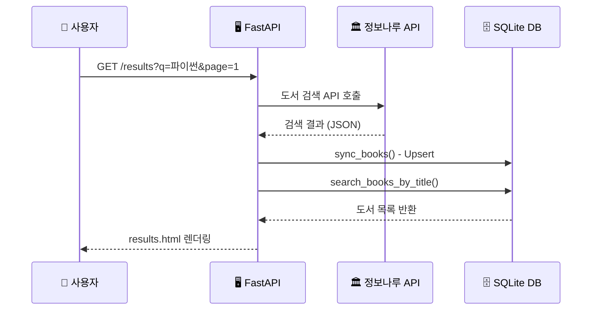
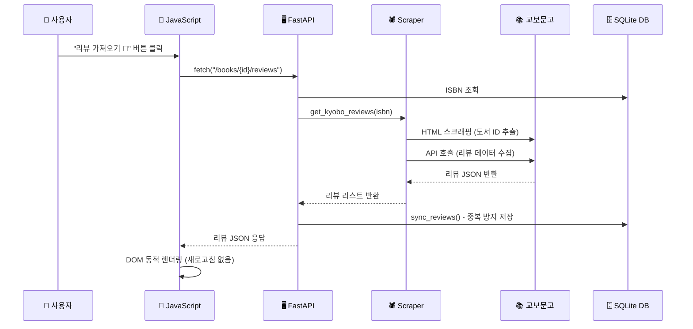
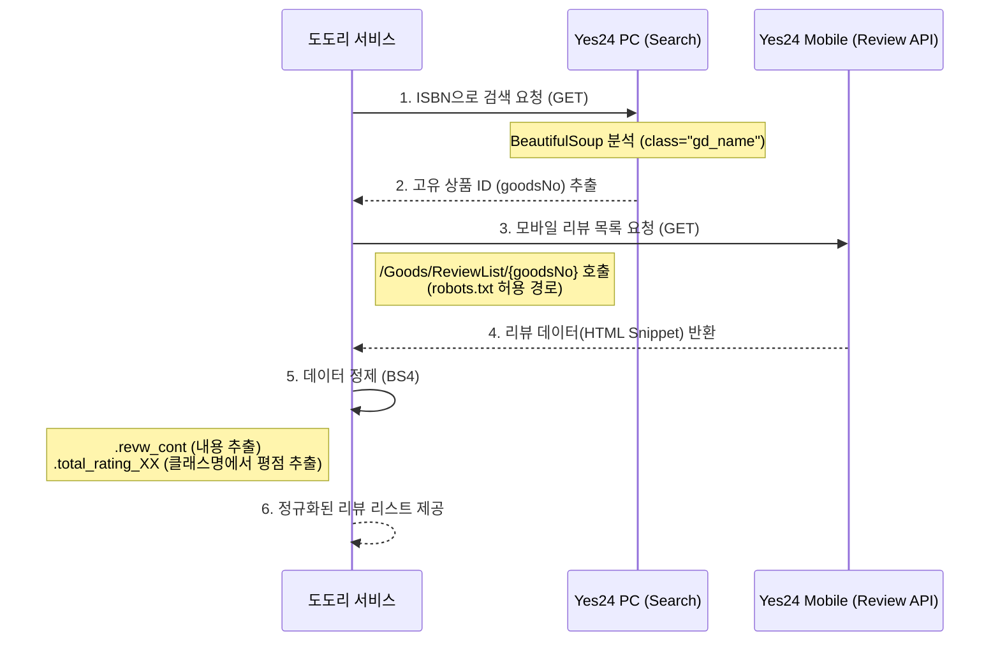
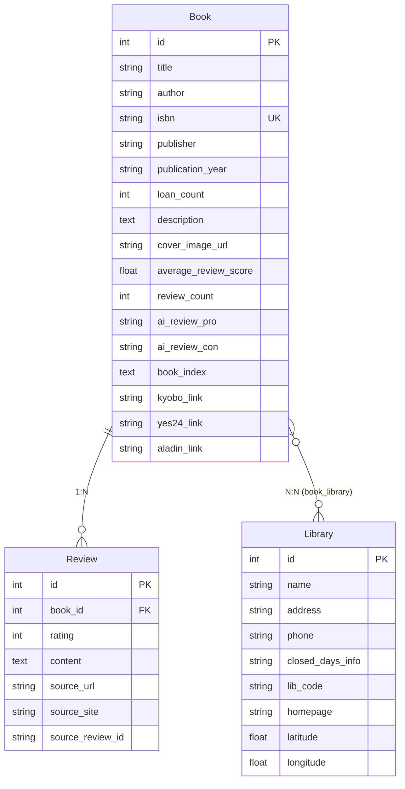

# 🐿️ 도도리 (Dodori) — 도서관 도서 리뷰 애그리게이터

> **흩어진 도서 리뷰를 한곳에 모으고, 지식의 발견을 대출이라는 행동으로 연결한다.**

[](https://dadocreview.onrender.com/)
[]()
[]()
[]()

도도리는 교보문고·Yes24 등 여러 서점 사이트에 흩어진 리뷰를 한곳에 모아, 주변 도서관에서 해당 도서의 대출 가능 여부까지 연결해 주는 **지능형 도서 리뷰 플랫폼**입니다.

---

## ✨ 주요 기능

### 🔍 통합 도서 검색 (Hybrid Search)
- 도서관 정보나루 Open API를 연동하여 **제목 기반 도서 검색**을 제공합니다.
- 검색된 도서 데이터를 **로컬 DB에 선별적으로 캐싱(Persistent Caching)** 하여, 외부 API의 실시간 데이터와 로컬 DB의 빠른 응답 속도를 모두 확보하는 하이브리드 전략을 사용합니다.
- **검색 결과 페이지네이션** 지원 (정보나루 API `pageNo`/`pageSize` 파라미터 활용).

### 💬 리뷰 애그리게이터 (Review Aggregator)
- **교보문고 리뷰 스크래퍼** 구현 완료: 하이브리드 방식(HTML 스크래핑 → 내부 API 호출)으로 안정적으로 리뷰를 수집합니다.
- **Yes24 리뷰 스크래퍼** 구현 완료: `robots.txt` 정책을 준수하는 모바일 API 경로를 활용하여 리뷰를 수집합니다.
- 도서 상세 페이지에서 **비동기(Fetch API) 리뷰 수집** 버튼을 통해 페이지 새로고침 없이 리뷰를 가져옵니다.
- 수집된 리뷰는 `source_review_id` 기반 **중복 방지 로직**으로 DB에 안전하게 저장됩니다.

### 🏛️ 도서관 연동 (Library Integration)
- 전국 **1,594개 공공도서관** 데이터를 DB에 마이그레이션하여 제공합니다.
- `/api/libraries` API를 통해 도서관 검색 기능을 제공합니다.
- `localStorage` 기반 즐겨찾기 도서관 저장 및 위치 기반(Geolocation) 도서관 소장 여부 확인 기능을 계획하고 있습니다.

### 🚀 배포 & 인프라
- **Render.com** 기반 무료 배포 완료.
- GitHub 저장소 연동을 통한 **자동 배포(Auto-Deploy)** 구성.

---

## 🏗️ 시스템 아키텍처

### 전체 데이터 흐름 (E2E Flow)

```
┌──────────────┐     검색 요청    ┌──────────────┐    API 호출     ┌─────────────────┐
│              │ ──────────────→ │              │ ─────────────→ │                 │
│   사용자      │                 │   FastAPI    │                │  도서관 정보나루   │
│  (Browser)   │ ←────────────── │   Server     │ ←───────────── │  Open API       │
│              │    HTML 응답     │              │   JSON 응답     │                 │
└──────────────┘                 └──────┬───────┘                └─────────────────┘
                                       │
                              Upsert   │   스크래핑
                                       │
                                 ┌─────▼──────┐                 ┌─────────────────┐
                                 │            │                 │  교보문고 API    │
                                 │  SQLite DB │ ←───────────── │  Yes24 Mobile   │
                                 │            │   리뷰 저장     │  (리뷰 수집)     │
                                 └────────────┘                 └─────────────────┘
```

### 하이브리드 검색 전략 (Hybrid Search)



### 비동기 리뷰 수집 흐름



### Yes24 리뷰 수집 흐름 (Mobile API Bypass)



---

## 🛠️ 기술 스택

| 분류 | 기술 | 선택 이유 |
| :--- | :--- | :--- |
| **Backend** | Python 3.12, FastAPI | 비동기 지원, 자동 API 문서화(Swagger), 타입 힌트 |
| **Database** | SQLite, SQLAlchemy (ORM) | 경량 DB로 MVP에 최적, ORM으로 DB 독립성 확보 |
| **Frontend** | Jinja2 (SSR), Vanilla JS, Vanilla CSS | 서버 사이드 렌더링(SEO 유리) + 클라이언트 비동기 처리 |
| **Data Collection** | Requests, BeautifulSoup4 | 하이브리드 스크래핑(HTML + JSON API) |
| **Deploy** | Render.com (Free Tier) | GitHub 연동 자동 배포, SSL 기본 제공 |
| **Version Control** | Git, GitHub | 체계적 커밋 전략, 브랜치 관리 |

---

## 📁 프로젝트 구조

```
dadoc_review/
├── app/
│   ├── main.py              # 🎯 FastAPI 앱 진입점 & URL 라우팅
│   ├── models.py            # 📐 DB 테이블 설계 (Book, Review, Library)
│   ├── schemas.py           # 🛡️ Pydantic 데이터 검증 스키마
│   ├── crud.py              # 🔧 DB CRUD 연산 (생성/조회/동기화)
│   ├── database.py          # 🗄️ SQLAlchemy 엔진 & 세션 설정
│   ├── services/
│   │   ├── naru_api.py      # 🏛️ 도서관 정보나루 API 연동
│   │   └── scraper.py       # 🕷️ 교보문고·Yes24 리뷰 스크래퍼
│   ├── templates/
│   │   ├── index.html       # 🏠 메인 검색 페이지
│   │   ├── search.html      # 🔍 도서관 검색 페이지
│   │   ├── results.html     # 📋 검색 결과 목록 페이지 (페이지네이션 포함)
│   │   └── book_detail.html # 📖 도서 상세 & 리뷰 페이지
│   └── static/
│       ├── css/
│       │   ├── common.css       # 🎨 공통 레이아웃 & 네비게이션
│       │   ├── index.css        # 🏠 메인 페이지 스타일
│       │   ├── search.css       # 🔍 검색 페이지 스타일
│       │   ├── results.css      # 📋 결과 페이지 스타일
│       │   └── book_detail.css  # 📖 상세 페이지 스타일
│       └── js/
│           ├── main.js          # 🔍 검색 이벤트 핸들러
│           └── book_detail.js   # 💬 비동기 리뷰 수집 로직
├── docs/
│   ├── MASTER_PROJECT_GUIDE.md       # 📘 통합 프로젝트 가이드
│   ├── TROUBLESHOOTING_LOG.md        # 🔧 트러블슈팅 기록
│   ├── UI_CODING_GUIDE.md            # 🎨 UI 코딩 가이드 & 체크리스트
│   ├── QNA_ARCHIVE.md                # 💡 기술적 Q&A 아카이브
│   ├── QUIZ_LOG.md                   # 📝 데일리 퀴즈 기록
│   ├── UML_01_SEARCH_E2E_FLOW.md     # 검색 E2E 시퀀스 다이어그램
│   ├── UML_02_HYBRID_SEARCH_LOGIC.md # 하이브리드 검색 설계
│   ├── UML_03_REVIEW_SCRAPING_LOGIC.md # 교보문고 리뷰 스크래핑 설계
│   ├── UML_04_ASYNC_REVIEW_SYNC.md   # 비동기 리뷰 동기화 설계
│   ├── UML_05_LIBRARY_INTEGRATION.md # 도서관 연동 시스템 설계
│   └── UML_06_YES24_SCRAPING_LOGIC.md # Yes24 리뷰 수집 설계
├── scripts/                 # 🔨 DB 마이그레이션 등 보조 스크립트
├── data/                    # 📦 도서관 정보 원본 데이터
├── requirements.txt         # 📦 Python 의존성 목록
├── .env                     # 🔑 환경 변수 (Git 추적 제외)
├── .gitignore
└── README.md
```

---

## 🗄️ DB 모델링 (ERD)



---

## 🧠 기술적 의사결정 (Design Rationale)

### Q: 왜 모든 도서 데이터를 DB에 미리 저장하지 않나요?

**A: 인프라 효율성과 실시간 데이터 확보를 위한 전략적 선택입니다.**

1. **데이터 신선도** — 매일 쏟아지는 신간 데이터를 로컬 DB에 동기화하는 것은 비효율적입니다. 외부 API를 통해 항상 최신 정보를 확보합니다.
2. **인프라 비용 최적화** — 전국 도서 데이터를 SQLite에 모두 담으면 수 GB 이상의 용량이 필요합니다. 사용자가 실제로 관심 있는 데이터만 '선별적 영속화(Persistent Caching)'합니다.
3. **데이터 소유권** — 외부 데이터를 무분별하게 대량 저장하지 않고, 서비스 운영에 필요한 개별 도서 정보만 적법하게 활용합니다.

### Q: 리뷰 스크래퍼를 어떤 전략으로 설계했나요?

**A: 안정성과 유지보수성을 고려한 하이브리드(HTML + API) 전략입니다.**

- **교보문고**: HTML 스크래핑으로 도서 고유 ID를 추출한 뒤, 내부 JSON API를 직접 호출하여 구조화된 데이터를 수집합니다.
- **Yes24**: `robots.txt` 정책을 준수하여, PC 검색으로 상품 ID를 확보한 뒤 허용된 모바일 리뷰 API를 호출합니다 (Header Paradox 해결 포함).
- **방어적 설계** — URL 구조를 분석하여 사이트 개편에도 견딜 수 있는 코드를 지향합니다.
- **에티켓 준수** — `User-Agent` 설정 및 요청 간격 조절을 통해 서버 부하를 최소화합니다.

### Q: 예외 처리를 어떻게 레이어로 분리했나요?

**A: 서비스 레이어와 라우터 레이어의 역할을 명확히 구분합니다.**

- **서비스 레이어 (`services/`)**: 외부 API·스크래핑 실패 시 빈 리스트(`[]`)를 반환하여 **Graceful Degradation**을 구현합니다.
- **라우터 레이어 (`main.py`)**: 비즈니스 규칙 위반(존재하지 않는 리소스, 잘못된 입력)은 `HTTPException`으로 명확한 HTTP 상태 코드를 반환합니다.

---

## 📅 개발 일정 (Timeline)

| 단계 | 목표 | 세부 내용 | 상태 |
| :--- | :--- | :--- | :---: |
| **Step 1** | 인프라 및 DB 설계 | FastAPI 구조 설정, 테이블 모델링 (Book, Review, Library) | ✅ 완료 |
| **Step 2** | UI & 데이터 연동 | 메인/결과/상세 페이지 구현 및 검색 API 연동 (E2E) | ✅ 완료 |
| **Step 3** | 데이터 수집 고도화 | 교보문고 리뷰 크롤러 개발 및 비동기 연동 | ✅ 완료 |
| **Step 3.5** | 배포 | Render.com 무료 배포 완료 | ✅ 완료 |
| **Step 4** | 기능 고도화 / 안정화 | 백엔드 예외 처리, 페이지네이션, 도서관 연동 백엔드, Yes24 리뷰 수집 | ✅ 완료 |
| **Step 5** | UI 전면 재설계 | `docs/imgs` 목업 기준 HTML/CSS 전면 재작성 | 🔄 진행 중 |
| **Step 6** | AI 리뷰 기능 | Gemini API 연동: 리뷰 장단점 요약 및 무관 리뷰 필터링 | ⏳ 대기 |
| **Step 7** | YouTube 연동 | 도서 상세 페이지에 책 관련 YouTube 영상 리스트 표시 | ⏳ 대기 |

### ✅ 완료된 주요 작업 이력

| 일자 | 작업 내용 |
| :--- | :--- |
| 2026-04-26 | 백엔드 예외 처리 강화 (타임아웃, Guard Clause, 404 처리) |
| 2026-04-27 | 프론트엔드 안정화 (`encodeURIComponent`, `trim()`, `fetch` 에러 핸들링) |
| 2026-04-28 | 검색 결과 페이지네이션 구현 |
| 2026-04-29 | 상세 페이지 콘텐츠 보강 & CSS 4개 파일로 모듈화 |
| 2026-04-30 | 전국 1,594개 도서관 DB 마이그레이션 & `/api/libraries` API 구현 |
| 2026-05-21 | Yes24 리뷰 수집 엔진 완성 (Header Paradox 해결, 평점 정규화) |

---

## 🔮 로드맵 (Upcoming Features)

- [ ] **UI 전면 재설계 완성** — 메인, 검색결과, 상세 탭(요약/리뷰/목차/상세정보) 페이지 구현
- [ ] **알라딘 리뷰 크롤링** — 다중 소스 리뷰 통합 수집
- [ ] **GitHub Actions CI/CD** — 코드 검증 후 자동 배포 파이프라인
- [ ] **주변 도서관 찾기** — Geolocation + 정보나루 도서관 API 연동
- [ ] **AI 리뷰 분석** — Google Gemini API로 리뷰 장단점 자동 요약 및 무관 리뷰 필터링
- [ ] **YouTube 연동** — YouTube Data API v3로 책 관련 영상 표시

---

## 🚀 시작하기 (Getting Started)

### 사전 요구사항

- Python 3.12+
- [도서관 정보나루 API 키](https://www.data4library.kr/) (무료 발급)

### 설치 및 실행

```bash
# 1. 저장소 클론
git clone https://github.com/yanJuicy/dadocreview.git
cd dadocreview

# 2. 가상환경 생성 & 활성화
python -m venv venv
source venv/bin/activate  # Windows: venv\Scripts\activate

# 3. 의존성 설치
pip install -r requirements.txt

# 4. 환경 변수 설정
echo "NARU_API_KEY=발급받은_API_키" > .env

# 5. 서버 실행
uvicorn app.main:app --reload

# 6. 브라우저에서 확인
# → http://localhost:8000
# → http://localhost:8000/docs (Swagger API 문서)
```

---

## 📚 프로젝트 문서

| 문서 | 설명 |
| :--- | :--- |
| [MASTER_PROJECT_GUIDE.md](docs/MASTER_PROJECT_GUIDE.md) | 프로젝트 비전, 기술 스택, 개발 지침 통합 문서 |
| [TROUBLESHOOTING_LOG.md](docs/TROUBLESHOOTING_LOG.md) | 개발 중 발생한 기술적 문제와 해결 과정 기록 |
| [UI_CODING_GUIDE.md](docs/UI_CODING_GUIDE.md) | UI 재설계 가이드 & 진행 체크리스트 |
| [QNA_ARCHIVE.md](docs/QNA_ARCHIVE.md) | 기술적 Q&A 및 심화 개념 아카이브 |
| [UML_01 ~ 06](docs/) | 시스템 핵심 로직별 시퀀스 다이어그램 (총 6종) |

---

## 🙋 만든 사람

**yanJuicy** — [GitHub](https://github.com/yanJuicy)

---

## 📄 License

This project is licensed under the MIT License.
