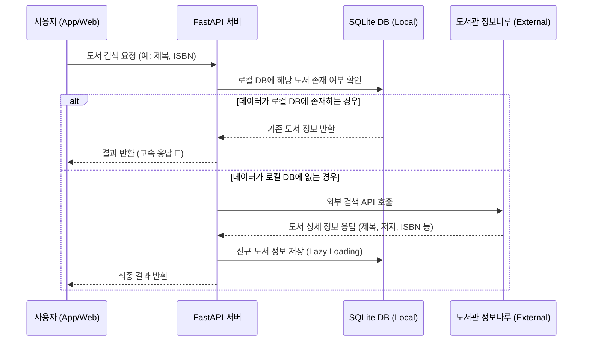

# 📚 다독 리뷰 (Dadoc Review) 프로젝트 마스터 가이드

본 문서는 프로젝트의 비전, 요구사항, 개발 지침 및 핵심 시스템 설계를 집대성한 통합 문서입니다.

---

## 1. 프로젝트 개요 (Overview)

### 1.1 프로젝트 비전
**"흩어진 도서 리뷰를 한곳에 모으고, 지식의 발견을 대출이라는 행동으로 연결한다."**
다독 리뷰는 여러 서점 사이트에 흩어진 리뷰를 AI로 요약하여 통찰을 제공하고, 실제 주변 도서관에서 대출 가능한지 실시간으로 연결해 주는 지능형 도서 플랫폼입니다.

### 1.2 핵심 가치 (Core Values)
1. **AI 기반 통찰 (AI Insight):** 수천 개의 리뷰를 직접 읽지 않아도 책의 정수를 파악할 수 있도록 돕습니다.
2. **행동 지향성 (Action-Oriented):** 책의 가치를 발견한 즉시 주변 도서관의 소장 여부를 확인하여 행동으로 연결합니다.
3. **데이터 기반 신뢰 (Data-Driven Trust):** 공공 데이터와 정제된 크롤링 데이터를 결합하여 신뢰할 수 있는 정보를 제공합니다.

---

## 2. 시스템 아키텍처 및 핵심 로직 (System Architecture)

### 2.1 도서 검색 및 데이터 동기화 흐름 (Hybrid Search Flow)
본 서비스는 검색의 **'실시간성'**과 데이터의 **'영속성'**을 모두 확보하기 위해 하이브리드 검색 전략을 사용합니다. 포트폴리오에서 시스템의 데이터 흐름을 대변하는 핵심 로직입니다.

### 2.2 기술적 의사결정 기록 (Design Rationale)

#### Q: 왜 모든 책 데이터를 DB에 미리 저장하지 않고 검색 API를 사용하나요?
**A: 인프라 효율성과 실시간 데이터 확보를 위한 전략적 선택입니다.**
1. **데이터 신선도 (Real-time Accuracy):** 매일 쏟아지는 수만 권의 신간 데이터를 로컬 DB에 실시간으로 동기화하는 것은 매우 무겁고 비효율적입니다. 외부 API를 사용하면 별도의 관리 비용 없이 항상 최신 정보를 얻을 수 있습니다.
2. **인프라 비용 및 성능 최적화:** 전국 도서 데이터를 SQLite에 모두 담으면 수 GB 이상의 용량이 필요하며 검색 속도가 저하됩니다. 사용자가 실제로 검색하고 관심 있는 데이터만 '선별적 영속화(Persistent Caching)' 함으로써 DB 성능을 최적으로 유지합니다.
3. **데이터 소유권 및 법적 준수:** 외부 데이터를 무분별하게 대량 저장하는 대신, 서비스 운영에 필요한 개별 도서 정보만 적법하게 활용하는 구조를 취했습니다.

---

## 3. 기능 및 기술 스택 (Features & Tech Stack)

### 3.1 주요 기능
- **통합 도서 검색:** 제목, 저자, ISBN 기반 검색 (외부 API 연동).
- **리뷰 애그리게이터:** 온라인 서점(교보, Yes24, 알라딘) 리뷰 크롤링 및 통합 조회.
- **AI 리뷰 분석:** Gemini API를 활용한 장단점 요약 및 핵심 통찰 추출.
- **도서관 연동:** 위치 기반 공공도서관 소장 여부 및 대출 가능 상태 실시간 조회.

### 3.2 기술 스택
- **언어 및 프레임워크:** Python, FastAPI
- **데이터베이스:** SQLite, SQLAlchemy (ORM)
- **AI:** Google Gemini (Generative AI)
- **데이터 수집:** `BeautifulSoup4` (크롤링), `Requests/HTTPX` (API 연동)

---

## 4. 개발 지침 (Development Guideline)

### 4.1 협업 및 코딩 원칙
1. **사용자 주도 코딩:** AI는 가이드와 로직을 제안하며, 실제 코드는 사용자가 직접 입력하여 체득한다.
2. **파일 역할 분리:** `models.py` (설계도), `schemas.py` (검증), `crud.py` (동작), `main.py` (컨트롤러)의 역할을 엄격히 분리한다.
3. **단계별 검증:** 하나의 기능을 만들 때마다 Swagger UI 등으로 실제 작동 여부를 즉시 검증한다.
4. **의사결정 및 UML 기록:** 모든 주요 기술적 의사결정(Design Rationale)과 복잡한 로직은 즉시 마스터 가이드에 기록하고 UML로 시각화하여 포트폴리오의 논리를 강화한다. (AI가 선제적으로 제안한다.)
5. **전략적 커밋 가이드:** 의미 있는 작업 단위(기능 구현, 문서화 완료 등)가 끝날 때마다 AI가 사용자에게 커밋 타이밍을 제안하여 체계적인 버전 관리를 돕는다.

---

**마지막 업데이트:** 2026-04-15
**작성자:** 사용자 & AI Pair Programmer (Antigravity)
