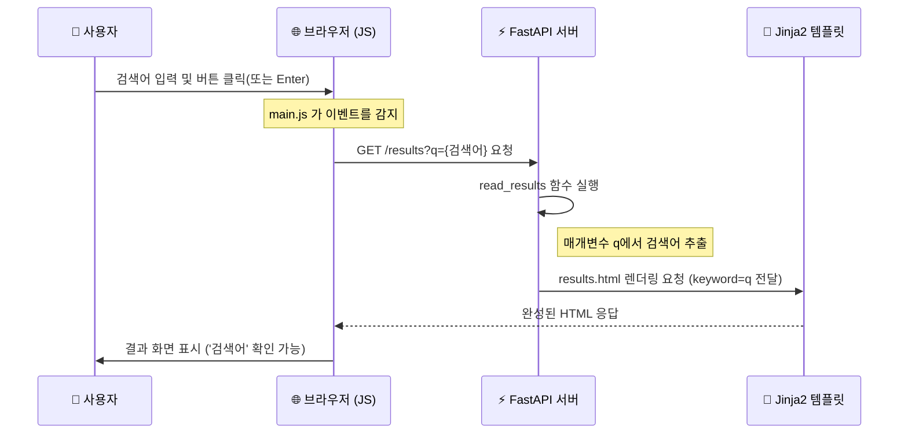

# 🔍 01. 검색 시스템 E2E 흐름도 (Search E2E Flow)

사용자가 메인 페이지에서 검색어를 입력하고 결과 페이지로 이동하여 검색어를 확인하기까지의 전체 과정을 시각화한 문서입니다.

## 1. 시퀀스 다이어그램 (Sequence Diagram)

## 2. 주요 설계 결정 (Design Decision)

- **방식:** GET 요청을 통한 페이지 전환
- **이유:**
  1. **고유 주소(URL) 확보:** 사용자가 특정 검색 결과 페이지의 주소를 복사해서 공유하거나 북마크할 수 있습니다. (예: `/results?q=파이썬`)
  2. **브라우저 히스토리:** 사용자가 '뒤로 가기' 버튼을 눌렀을 때 자연스럽게 메인 검색창으로 돌아올 수 있습니다.
  3. **데이터 전달 편의성:** 서버 측에서 Query Parameter를 통해 간편하게 검색어를 수집하고 템플릿에 전달할 수 있습니다.
