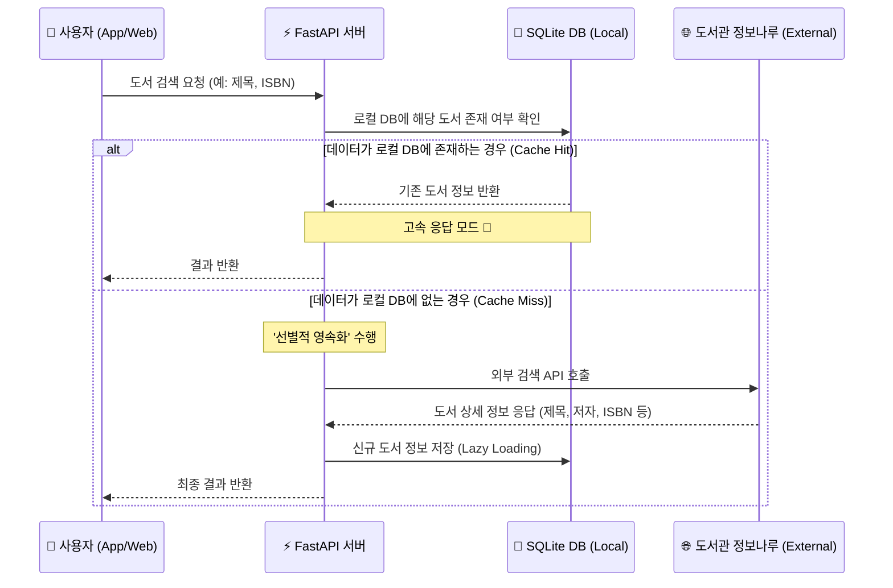

# 🔄 02. 하이브리드 검색 시스템 (Hybrid Search Logic)

사용자가 검색을 요청했을 때, 성능 최적화(DB 캐싱)와 데이터 최신성(외부 API)을 모두 잡기 위한 하이브리드 검색 흐름도입니다.

## 1. 시퀀스 다이어그램 (Sequence Diagram)

## 2. 기술적 의사결정 기록 (Design Rationale)

### Q: 왜 모든 책 데이터를 DB에 미리 저장하지 않나요?
**A: 인프라 효율성과 실시간성 때문입니다.**
1. **데이터 신선도:** 매일 쏟아지는 신간 데이터를 모두 동기화하는 것은 비효율적입니다. 외부 API를 통해 항상 최신 정보를 얻습니다.
2. **저장공간 최적화:** 사용자가 실제로 검색한 데이터만 DB에 저장하는 'Lazy Loading(Persistent Caching)' 방식을 택해 DB 용량을 가볍게 유지합니다.
3. **응답 속도:** 한 번 검색된 책은 로컬 DB에서 즉시 반환되므로, 재검색 시의 성능이 비약적으로 향상됩니다.
