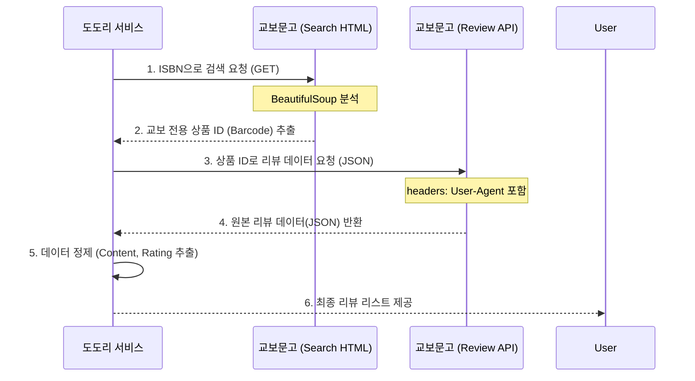

# 🕸️ UML 03: 리뷰 수집 시스템 (Scraping Logic)

도도리 서비스의 핵심인 외부 리뷰 수집 로직의 흐름과 아키텍처 의사결정을 기록합니다.

## 1. 리뷰 수집 시퀀스 다이어그램 (Sequence Diagram)

본 서비스는 안정적인 데이터 수집을 위해 **'HTML 검색'**과 **'JSON API'**를 결합한 하이브리드 방식을 사용합니다.

## 2. 핵심 설계 의사결정 (Design Rationale)

### 2.1 왜 HTML 스크래핑 대신 API를 혼합했나요?
*   **안정성(Stability)**: HTML 구조는 디자인 변경에 따라 수시로 변하지만, API 응답(JSON)은 구조가 비교적 고정되어 있어 유지보수 비용이 낮습니다.
*   **성능(Performance)**: 무거운 HTML 전체를 로드하는 것보다 필요한 데이터만 담긴 JSON을 받는 것이 서버 자원과 속도 측면에서 압도적으로 유리합니다.

### 2.2 'S'로 시작하는 ID 조건 대신 URL 패턴을 쓴 이유
*   교보문고의 내부 ID 체계(`S000...`)가 변경되더라도 `product.../detail/` 이라는 URL 경로 규칙은 유지될 확률이 높으므로, 더 **확장성 있고 튼튼한(Robust)** 코드를 만들기 위해 구조적 특징을 기반으로 설계했습니다.
