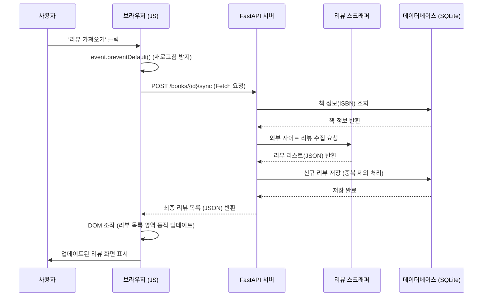

# 🏗️ 비동기 리뷰 동기화 시스템 (Async Review Sync)

본 문서는 상세 페이지에서 사용자의 요청에 따라 실시간으로 리뷰를 수집하고, 페이지 새로고침 없이 화면을 업데이트하는 비동기(AJAX) 흐름을 설명합니다.

---

## 1. 개요 (Overview)
사용자가 도서 상세 정보를 확인할 때, 리뷰 데이터가 DB에 없거나 최신화가 필요할 경우 버튼 하나로 실시간 크롤링을 수행합니다. 성능과 사용자 경험을 위해 **Fetch API**를 사용하여 비동기적으로 처리합니다.

---

## 2. 시퀀스 다이어그램 (Sequence Diagram)

---

## 3. 주요 기술 구성 (Key Components)

### 3.1 Backend: JSON 전용 Endpoint
템플릿을 반환하는 대신, 클라이언트가 처리하기 쉬운 JSON 배열 형태의 데이터를 반환하도록 설계되었습니다.

### 3.2 Frontend: Fetch 기반 인터랙션
비정형 데이터를 동적으로 화면에 끼워 넣기 위해 `insertAdjacentHTML`을 활용하여 기존 CSS 레이아웃을 그대로 유지하면서 컨텐츠만 교체합니다.

### 3.3 안정성 전략 (Exception Handling)
- **로딩 상태 관리**: 요청 중에는 버튼을 비활성화(`disabled`)하여 중복 요청을 방지합니다.
- **데이터 유무 처리**: 수집된 결과가 없을 경우 사용자에게 적절한 피드백 메시지를 노출합니다.
