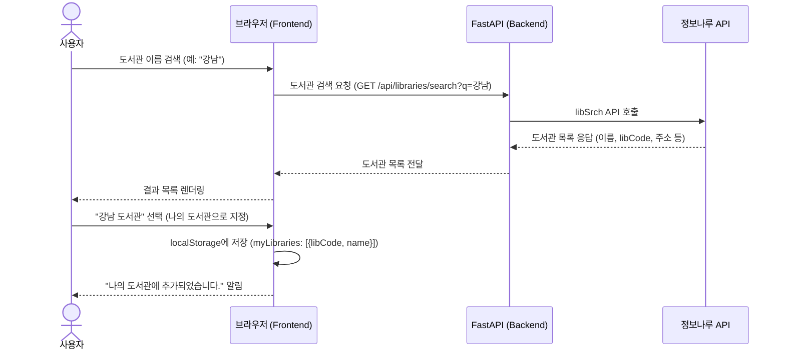
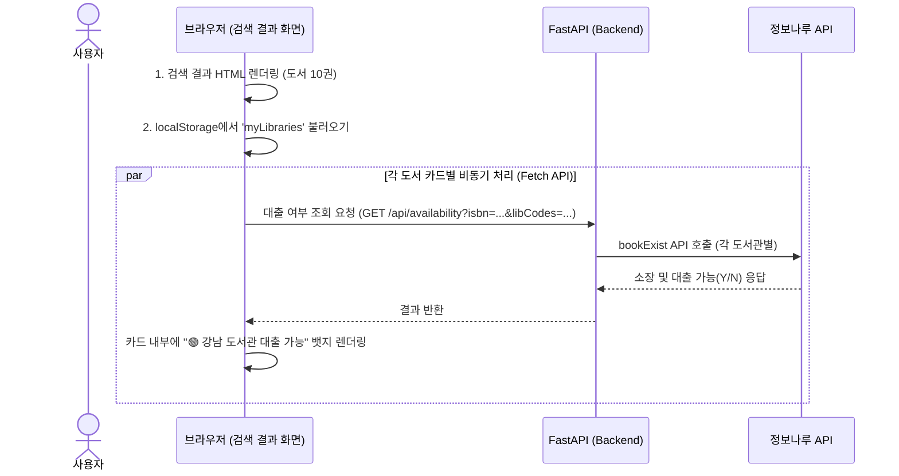
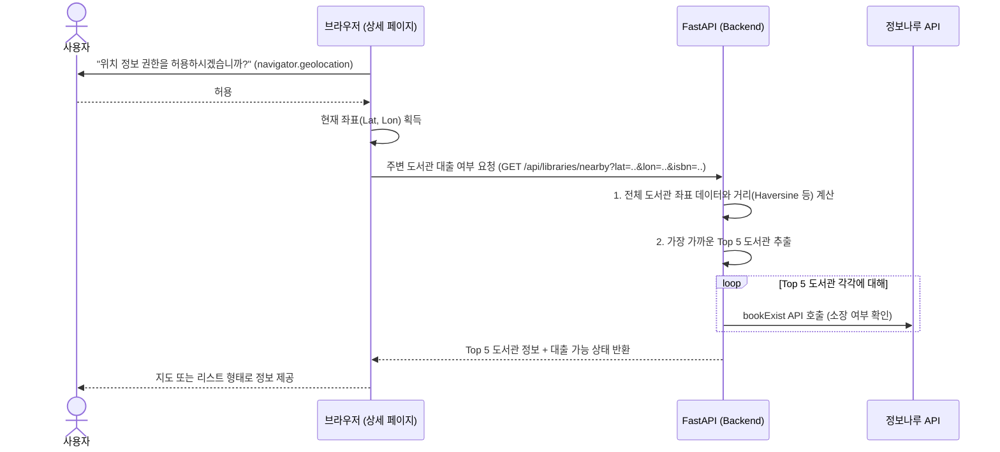

# 🏛️ [UML 05] 도서관 연동 및 실시간 대출 조회 로직 (Library Integration Flow)

본 문서는 사용자의 개인화된 도서관 설정(localStorage)과 위치 기반(Geolocation) 정보를 활용하여, 실시간으로 주변 도서관의 소장 및 대출 가능 여부를 확인하는 핵심 아키텍처를 정의합니다.

---

## 1. 나의 도서관 설정 시퀀스 (메인 페이지)
사용자가 자주 가는 도서관을 브라우저에 저장하여, 회원가입 없이도 개인화된 경험을 제공합니다.

---

## 2. 비동기 대출 가능 여부 확인 시퀀스 (검색 결과 페이지)
검색 결과 화면 로딩 속도를 저하시키지 않기 위해, 책 목록을 먼저 보여준 뒤 '나의 도서관' 대출 여부만 조용히 비동기로 조회합니다.

---

## 3. 위치 기반 주변 도서관 조회 시퀀스 (도서 상세 페이지)
사용자의 현재 위치(위도, 경도)를 기반으로 가장 가까운 도서관을 찾아 대출 가능 여부를 안내합니다.

---

## 💡 기술적 의사결정 (Design Rationale)

1. **DB 기반 회원가입 대신 `localStorage` 사용**: 
   - 사용자가 서비스를 경험하기 위한 진입 장벽(회원가입)을 완전히 없앱니다.
   - 개인정보(선호 도서관)를 서버에 저장하지 않으므로 개인정보 보호 법규에서 자유롭습니다.
2. **비동기 렌더링 (Async Fetch)**:
   - 정보나루 API(bookExist)는 속도가 느릴 수 있습니다. 이 응답을 기다렸다가 화면을 그리면 사용자 이탈률이 높아집니다.
   - 따라서 껍데기(책 정보)를 먼저 보여주고, 대출 가능 여부는 로딩 스피너(빙글빙글 도는 UI)를 보여주다 결과를 채워 넣는(Lazy Loading) 방식으로 체감 성능을 극대화합니다.
3. **위치 기반 서비스 (Geolocation)**:
   - "책의 가치를 발견한 즉시 주변 도서관으로 연결한다"는 프로젝트 핵심 가치(Core Value)를 실현하는 가장 중요한 기능입니다.
