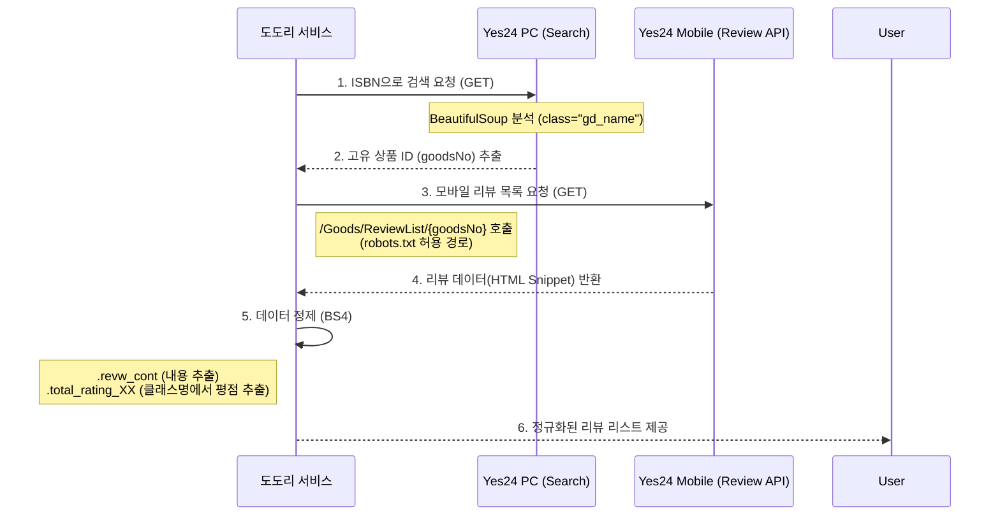

# 🕸️ UML 06: Yes24 리뷰 수집 시스템 (Mobile API Bypass)

Yes24의 `robots.txt` 정책을 준수하면서도 효율적으로 데이터를 수집하기 위해 모바일 경로를 활용한 수집 로직을 설계하고 기록합니다.

## 1. 수집 시퀀스 다이어그램 (Sequence Diagram)

본 로직은 PC 버전의 수집 제한을 피하기 위해 **'PC 검색'**으로 ID를 확보한 후, **'모바일 전용 리뷰 API(Allowed)'**를 호출하는 전략을 사용합니다.

## 2. 핵심 설계 의사결정 (Design Rationale)

### 2.1 왜 모바일 경로(`m.yes24.com`)를 선택했나요?
*   **정책 준수 (Robots.txt)**: PC 버전의 리뷰 API(`GoodsReviewList`)는 `robots.txt`에서 수집이 금지되어 있으나, 모바일 버전의 특정 경로(`ReviewList`)는 명시적 차단 목록에 포함되지 않아 안정적인 수집이 가능합니다.
*   **효율성**: 모바일 API는 모바일 환경에 최적화되어 있어 데이터 크기가 상대적으로 작고 응답 속도가 빠릅니다.

### 2.2 평점(Rating) 추출 전략
*   **CSS Class 기반 분석**: 평점이 텍스트가 아닌 클래스명(`total_rating_10` 등)으로 부여되어 있습니다. 이는 단순 텍스트 추출보다 구조적인 접근이 필요하며, `BeautifulSoup`의 클래스 리스트 속성을 활용하여 견고하게 구현합니다.

### 2.4 봇 감지 우회 (Header Paradox)
*   **관찰 결과**: Yes24 PC 검색 페이지의 경우, 정교하게 꾸며진 `User-Agent` 헤더를 보낼 때보다 오히려 헤더를 비우고(`requests` 기본값 사용) 접근할 때 리다이렉트 없이 검색 결과가 더 잘 반환되는 현상이 확인되었습니다.
*   **전략**: 서버의 보안 정책에 따라 가장 잘 작동하는 헤더 조합(현재는 기본 헤더)을 우선적으로 사용하며, 향후 차단 시 모바일 검색 URL로 전환하는 예비 로직을 유지합니다.

## 3. 구현 현황 (Implementation Status)

- [x] ISBN 기반 Yes24 상품 ID(goodsNo) 추출 로직 (`fetch_yes24_goods_id`)
- [x] 모바일 리뷰 엔드포인트 기반 파싱 로직 (`fetch_yes24_review`)
- [x] 평점(10점 만점) 및 내용 추출 정규화
- [ ] 여러 페이지 순회(Pagination) 로직 추가
- [ ] 알라딘(Aladin) 채널 확장 준비
