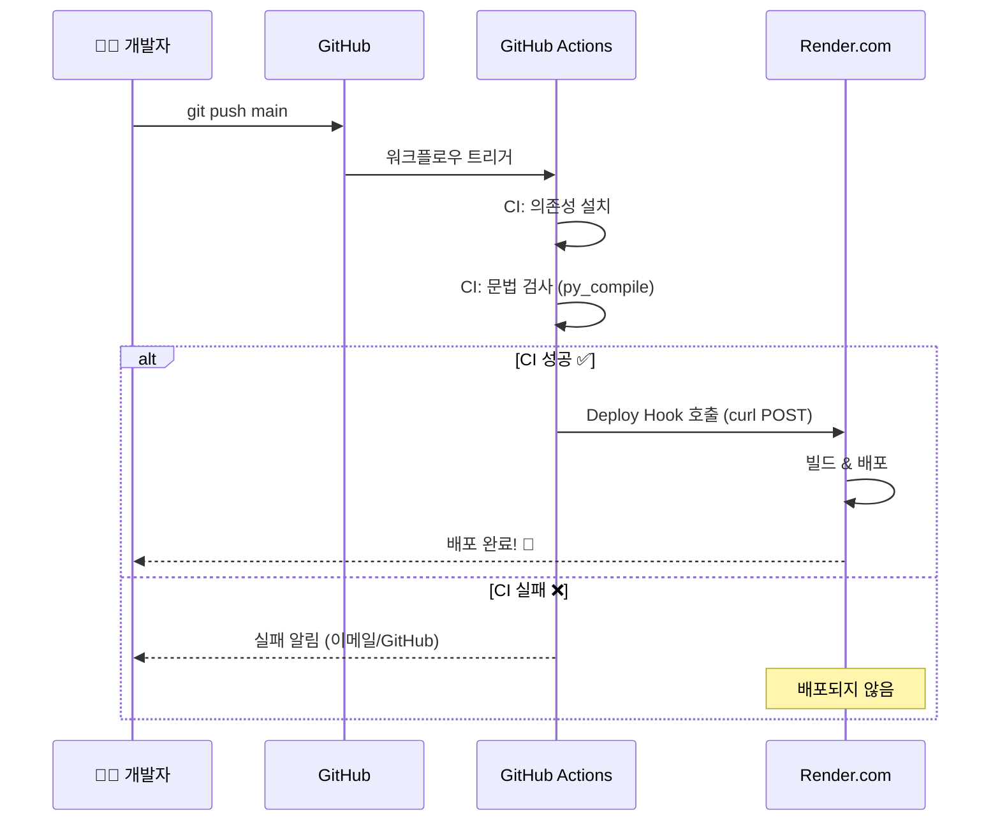
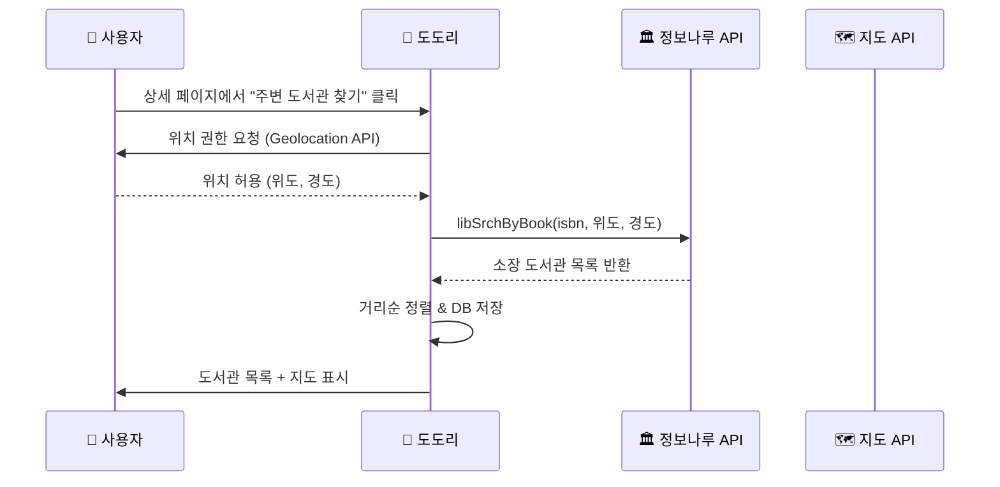
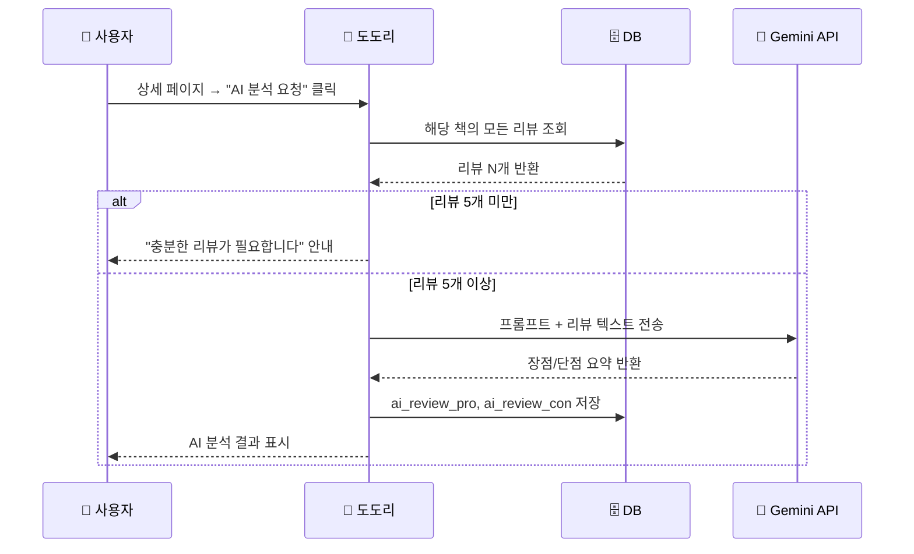

# 📅 2026-04-23 작업 가이드

> **목표:** 배포 → CI/CD 자동화 → 기능 고도화 → 차기 개발 단계 설계  
> **현재 프로젝트 상태:** Step 3 완료 (리뷰 스크래퍼 엔진 연동까지)  
> **GitHub:** https://github.com/yanJuicy/dadocreview.git

---

## 📋 오늘의 작업 순서 (Overview)

| 순서 | 작업 | 예상 소요 | 우선순위 |
| :---: | :--- | :---: | :---: |
| **1** | Render.com 무료 배포 | 30분 | 🔴 |
| **2** | GitHub Actions CI/CD 파이프라인 구축 | 30분 | 🔴 |
| **3** | 정보나루 API 페이징 적용 | 1시간 | 🟡 |
| **4** | 상세 페이지 콘텐츠 보강 | 1시간 | 🟡 |
| **5** | 전체 디자인 개선 | 1~2시간 | 🟡 |
| **6** | Yes24·알라딘 리뷰 크롤링 | 2시간 | 🟡 |
| **7** | 주변 도서관 찾기 설계 | 설계만 | 🟢 |
| **8** | AI 리뷰 생성 설계 | 설계만 | 🟢 |

---

## 1️⃣ Render.com 무료 배포

### 1.1 왜 Render.com인가?
| 비교 항목 | Render | Railway | Vercel |
| :--- | :--- | :--- | :--- |
| Python/FastAPI 지원 | ✅ 네이티브 | ✅ | ❌ (서버리스 한정) |
| 무료 티어 | ✅ (월 750시간) | ⚠️ (월 $5 크레딧) | ❌ (Python 미지원) |
| GitHub 연동 | ✅ 자동 배포 | ✅ | ✅ |
| SQLite 사용 가능 | ⚠️ (주의사항 있음) | ⚠️ | ❌ |

> **⚠️ SQLite 주의사항:** Render 무료 티어는 **영속적 디스크를 제공하지 않는다.** 즉, 서비스가 재시작되면 `sql_app.db` 파일이 초기화된다. MVP 단계에서는 괜찮지만, 나중에 **PostgreSQL**(Render 무료 DB 제공)로 마이그레이션하는 것을 권장한다.

### 1.2 배포 전 프로젝트 준비 (필수 파일 생성)

#### Step A: `requirements.txt` 업데이트

현재 `requirements.txt`에 `requests`와 `beautifulsoup4`가 빠져 있다. 스크래퍼에서 사용 중이므로 반드시 추가해야 한다.

```txt
fastapi
uvicorn[standard]
sqlalchemy
jinja2
python-multipart
python-dotenv
alembic
pydantic
pydantic-settings
requests
beautifulsoup4
```

> **💡 팁:** `uvicorn`을 `uvicorn[standard]`로 변경하면 프로덕션에서 더 나은 성능의 이벤트 루프를 사용한다.

#### Step B: `render.yaml` 생성 (프로젝트 루트)

Render에게 "이 프로젝트를 어떻게 빌드하고 실행할지" 알려주는 설정 파일이다.

```yaml
# render.yaml
services:
  - type: web
    name: dadoc-review
    runtime: python
    buildCommand: pip install -r requirements.txt
    startCommand: uvicorn app.main:app --host 0.0.0.0 --port $PORT
    envVars:
      - key: NARU_API_KEY
        sync: false  # Render 대시보드에서 직접 입력
      - key: PYTHON_VERSION
        value: "3.12"
```

#### Step C: `.python-version` 파일 생성 (프로젝트 루트)

```
3.12
```

> Render가 빌드 시 이 파일을 읽어 Python 버전을 결정한다.

### 1.3 Render 배포 실행 (단계별)

```
┌─────────────────────────────────────────────────┐
│  1. https://render.com 접속 → GitHub 계정 로그인  │
│  2. 대시보드에서 [New +] → [Web Service] 클릭     │
│  3. GitHub 저장소 연결: yanJuicy/dadocreview      │
│  4. 설정 입력:                                    │
│     - Name: dadoc-review                         │
│     - Runtime: Python 3                          │
│     - Build Command:                             │
│       pip install -r requirements.txt            │
│     - Start Command:                             │
│       uvicorn app.main:app                       │
│         --host 0.0.0.0 --port $PORT              │
│     - Instance Type: Free                        │
│  5. Environment 탭에서 환경 변수 추가:             │
│     - Key: NARU_API_KEY                          │
│     - Value: (실제 API 키 값)                     │
│  6. [Create Web Service] 클릭                    │
│  7. 빌드 로그 확인 → 배포 완료!                    │
│  8. https://dadoc-review.onrender.com 접속 확인   │
└─────────────────────────────────────────────────┘
```

### 1.4 배포 후 체크리스트

- [ ] 메인 페이지(`/`) 정상 접속
- [ ] 검색 기능(`/results?q=파이썬`) 정상 작동
- [ ] 상세 페이지(`/books/{id}`) 정상 접속
- [ ] 리뷰 가져오기 버튼 정상 작동
- [ ] 환경 변수(NARU_API_KEY) 정상 로딩

### 1.5 자주 발생하는 문제 & 해결

| 문제 | 원인 | 해결 |
| :--- | :--- | :--- |
| `ModuleNotFoundError: No module named 'bs4'` | requirements.txt에 beautifulsoup4 누락 | requirements.txt에 추가 후 재배포 |
| 15분 후 사이트 응답 없음 | Render 무료 티어 idle spin-down | 정상 동작. 다시 요청하면 ~30초 후 깨어남 |
| DB 데이터 사라짐 | Render 무료 티어는 디스크 비영속 | PostgreSQL 전환 또는 감수 |
| `.env` 파일의 키 미적용 | Render는 .env를 읽지 않음 | Render 대시보드 Environment 탭에서 설정 |

---

## 2️⃣ GitHub Actions CI/CD 자동화

### 2.1 CI/CD 개념 요약

```
개발자 코드 push → GitHub Actions 자동 실행 → 테스트 → Render 자동 배포
    (Local)              (CI: 검증)                    (CD: 배포)
```

### 2.2 전략: Render Deploy Hook + GitHub Actions

Render는 GitHub에 push하면 자동으로 재배포하는 기능을 기본 제공한다. 하지만 **CI(테스트/린트)를 먼저 통과한 후에만 배포**되도록 하기 위해 GitHub Actions를 활용한다.

### 2.3 Render Deploy Hook 설정

```
┌──────────────────────────────────────────────────────┐
│  1. Render 대시보드 → dadoc-review 서비스 선택        │
│  2. Settings 탭 → Build & Deploy 섹션               │
│  3. "Auto-Deploy" 항목을 "No"로 변경                 │
│     (GitHub Actions가 제어하도록)                     │
│  4. Deploy Hook URL 복사                             │
│     (ex: https://api.render.com/deploy/srv-xxx?key=yyy) │
│  5. GitHub → 저장소 Settings → Secrets and variables  │
│     → Actions → New repository secret                │
│     - Name: RENDER_DEPLOY_HOOK_URL                   │
│     - Value: (복사한 Deploy Hook URL)                 │
└──────────────────────────────────────────────────────┘
```

### 2.4 GitHub Actions 워크플로우 파일 생성

프로젝트 루트에 `.github/workflows/ci-cd.yml` 파일을 생성한다.

```yaml
# .github/workflows/ci-cd.yml
name: CI/CD Pipeline

# main 브랜치에 push 또는 PR이 올라올 때 실행
on:
  push:
    branches: [main]
  pull_request:
    branches: [main]

jobs:
  # ============================================
  # Job 1: CI - 코드 품질 검증
  # ============================================
  ci:
    name: 🔍 Code Quality Check
    runs-on: ubuntu-latest

    steps:
      # 1) 코드 체크아웃
      - name: Checkout code
        uses: actions/checkout@v4

      # 2) Python 환경 설정
      - name: Set up Python
        uses: actions/setup-python@v5
        with:
          python-version: "3.12"

      # 3) 의존성 설치
      - name: Install dependencies
        run: |
          python -m pip install --upgrade pip
          pip install -r requirements.txt

      # 4) 문법 오류 검사 (Python 파일 컴파일 체크)
      - name: Syntax check
        run: |
          python -m py_compile app/main.py
          python -m py_compile app/crud.py
          python -m py_compile app/models.py
          python -m py_compile app/database.py
          python -m py_compile app/schemas.py
          python -m py_compile app/services/naru_api.py
          python -m py_compile app/services/scraper.py

      # 5) (선택) 테스트 실행 - 나중에 pytest 도입 시 활성화
      # - name: Run tests
      #   run: pytest tests/ -v

  # ============================================
  # Job 2: CD - Render 배포 트리거
  # ============================================
  cd:
    name: 🚀 Deploy to Render
    runs-on: ubuntu-latest
    needs: ci  # CI가 성공해야만 실행
    if: github.event_name == 'push' && github.ref == 'refs/heads/main'

    steps:
      - name: Trigger Render Deploy
        run: |
          curl -X POST "${{ secrets.RENDER_DEPLOY_HOOK_URL }}"
```

### 2.5 CI/CD 동작 흐름



### 2.6 CI/CD 설정 후 테스트 방법

```bash
# 1. 워크플로우 파일 커밋 & 푸시
git add .github/workflows/ci-cd.yml render.yaml .python-version
git commit -m "ci: GitHub Actions CI/CD 파이프라인 구축"
git push origin main

# 2. GitHub → 저장소 → Actions 탭에서 워크플로우 실행 확인
# 3. CI 성공 후 Render 대시보드에서 배포 진행 확인
```

---

## 3️⃣ 정보나루 API 검색 결과 페이징 적용

### 3.1 현재 문제점

현재 `naru_api.py`의 `fetch_books_from_naru()` 함수는 **첫 번째 페이지만 가져온다.** API가 기본 10건만 반환하므로, 사용자가 검색하면 최대 10개의 결과만 볼 수 있다.

### 3.2 정보나루 API 페이징 파라미터

| 파라미터 | 설명 | 기본값 |
| :--- | :--- | :--- |
| `pageNo` | 조회할 페이지 번호 | 1 |
| `pageSize` | 한 페이지당 결과 수 | 10 |

**응답에 포함되는 페이징 정보:**
```json
{
  "response": {
    "request": { ... },
    "resultNum": 10,      // 현재 페이지 결과 수
    "numFound": 253,      // 전체 검색 결과 수
    "docs": [ ... ]
  }
}
```

### 3.3 구현 계획

#### A. 백엔드 수정 (`app/services/naru_api.py`)

```python
# 수정할 부분: 페이징 파라미터 추가
def fetch_books_from_naru(keyword: str, page: int = 1, page_size: int = 10):
    url = (
        f"http://data4library.kr/api/srchBooks"
        f"?authKey={NARU_API_KEY}"
        f"&format=json"
        f"&title={keyword}"
        f"&pageNo={page}"
        f"&pageSize={page_size}"
    )
    response = requests.get(url)
    data = response.json()

    raw_docs = data.get("response", {}).get("docs", [])
    num_found = data.get("response", {}).get("numFound", 0)  # 전체 결과 수

    books = []
    for item in raw_docs:
        doc = item.get("doc")
        refined_book = {
            "title": doc.get("bookname"),
            "author": doc.get("authors"),
            "isbn": doc.get("isbn13"),
            "cover_image_url": doc.get("bookImageURL"),
        }
        books.append(refined_book)

    # 페이징 메타 정보도 함께 반환
    return {
        "books": books,
        "total": num_found,
        "page": page,
        "page_size": page_size,
        "total_pages": (num_found + page_size - 1) // page_size,
    }
```

#### B. 라우터 수정 (`app/main.py`)

```python
@app.get("/results", response_class=HTMLResponse)
def read_results(
    request: Request,
    q: str = None,
    page: int = 1,              # 페이지 번호 쿼리 파라미터 추가
    db: Session = Depends(get_db)
):
    result = naru_api.fetch_books_from_naru(q, page=page)
    crud.sync_books(db, result["books"])

    books = crud.search_books_by_title(db=db, title=q)

    return templates.TemplateResponse(
        request, "results.html", {
            "keyword": q,
            "books": books,
            "page": result["page"],
            "total_pages": result["total_pages"],
            "total": result["total"],
        }
    )
```

#### C. 프론트엔드 수정 (`results.html`)

검색 결과 하단에 페이지네이션 UI를 추가한다.

```html
<!-- 페이지네이션 -->
<nav class="pagination">
    
    <a href="/results?q={{ keyword }}&page={{ page - 1 }}" class="page-btn">◀ 이전</a>
    
    
    <span class="page-info">{{ page }} / {{ total_pages }} 페이지 (총 {{ total }}건)</span>
    
    
    <a href="/results?q={{ keyword }}&page={{ page + 1 }}" class="page-btn">다음 ▶</a>
    
</nav>
```

### 3.4 체크리스트

- [ ] `naru_api.py`에 `pageNo`, `pageSize` 파라미터 추가
- [ ] 응답에서 `numFound` 추출하여 메타 정보 반환
- [ ] `main.py` 라우터에 `page` 쿼리 파라미터 추가
- [ ] `results.html`에 페이지네이션 UI 추가
- [ ] `style.css`에 페이지네이션 스타일 추가
- [ ] 1페이지 → 2페이지 → 마지막 페이지 이동 테스트
- [ ] 단, DB에 이미 저장된 결과와의 중복 처리 고려

---

## 4️⃣ 상세 페이지 콘텐츠 보강

### 4.1 현재 상태 분석

현재 `book_detail.html`에 표시되는 정보:
- ✅ 표지 이미지
- ✅ 제목, 저자
- ✅ 리뷰 가져오기 버튼
- ✅ 리뷰 목록
- ❌ ISBN 정보 없음
- ❌ 책 설명(description) 없음
- ❌ 외부 서점 링크 없음
- ❌ 평균 별점 없음
- ❌ AI 요약 영역 없음

### 4.2 보강할 항목

#### A. 책 기본 정보 확장

```
┌────────────────────────────────────────────────┐
│  [표지]    제목: 파이썬 완벽 가이드             │
│            저자: 홍길동                         │
│            ISBN: 978-11-306-3571-2             │
│            설명: 파이썬을 처음 시작하는...       │
│                                                │
│            [교보문고]  [Yes24]  [알라딘]         │
│            ⭐ 평균 4.2점 (리뷰 127개)           │
└────────────────────────────────────────────────┘
```

#### B. 수정할 파일과 내용

**1) `naru_api.py` — 정보나루에서 추가 데이터 수집**

정보나루 API 응답에는 `bookDtlUrl`(상세 URL), `description`(설명) 등의 필드가 있다. 현재 title, author, isbn, cover만 가져오고 있으므로 확장한다.

```python
refined_book = {
    "title": doc.get("bookname"),
    "author": doc.get("authors"),
    "isbn": doc.get("isbn13"),
    "cover_image_url": doc.get("bookImageURL"),
    "description": doc.get("description", ""),       # 추가
    "book_detail_url": doc.get("bookDtlUrl", ""),    # 추가
}
```

**2) `book_detail.html` — 상세 정보 표시 영역 추가**

```html
<!-- 기존 detail-info 안에 추가 -->
<p class="detail-isbn">ISBN: {{ book.isbn }}</p>
<p class="detail-description">{{ book.description }}</p>

<!-- 외부 서점 링크 -->
<div class="external-links">
    
    <a href="{{ book.kyobo_link }}" target="_blank" class="store-link kyobo">교보문고</a>
    
    
    <a href="{{ book.yes24_link }}" target="_blank" class="store-link yes24">Yes24</a>
    
    
    <a href="{{ book.aladin_link }}" target="_blank" class="store-link aladin">알라딘</a>
    
</div>

<!-- 리뷰 통계 (리뷰가 있을 때) -->

<div class="review-stats">
    <span class="avg-score">⭐ 평균 {{ "%.1f"|format(book.average_review_score or 0) }}점</span>
    <span class="review-count">(리뷰 {{ book.reviews|length }}개)</span>
</div>

```

**3) 향후 AI 요약 영역 자리 확보**

```html
<!-- AI 리뷰 분석 (Step 4에서 채울 영역) -->
<section class="ai-analysis-section">
    <h3>🤖 AI가 분석한 이 책의 핵심</h3>
    
    <div class="ai-pro">
        <h4>👍 장점</h4>
        <p>{{ book.ai_review_pro }}</p>
    </div>
    <div class="ai-con">
        <h4>👎 단점</h4>
        <p>{{ book.ai_review_con }}</p>
    </div>
    
    <div class="empty-state">
        <p>충분한 리뷰가 모이면 AI가 분석을 시작합니다 🐿️</p>
    </div>
    
</section>
```

### 4.3 체크리스트

- [ ] `naru_api.py`에서 description 등 추가 필드 수집
- [ ] `crud.py`의 `create_book`에서 새 필드 저장 처리
- [ ] `book_detail.html` 기본 정보 영역 확장
- [ ] 외부 서점 링크 버튼 추가
- [ ] 리뷰 통계 (평균 별점, 리뷰 수) 표시
- [ ] AI 분석 영역 placeholder 배치
- [ ] CSS 스타일링

---

## 5️⃣ 전체 디자인 개선

### 5.1 현재 디자인 문제점

1. **색상 체계 부재** — 일관된 컬러 팔레트 없이 개별 색상 사용
2. **타이포그래피** — 기본 시스템 폰트에 의존
3. **카드 UI** — 검색 결과 카드의 호버 효과·그림자 부족
4. **반응형** — 모바일 대응 미흡
5. **빈 상태 UI** — 로딩/에러 상태 디자인 부재

### 5.2 디자인 개선 방향

#### A. 디자인 시스템 정의 (`style.css` 최상단에 CSS 변수로)

```css
:root {
    /* 메인 컬러 팔레트 (도토리·숲 테마) */
    --color-primary: #8B6914;        /* 도토리 갈색 */
    --color-primary-light: #C4A35A;  /* 밝은 갈색 */
    --color-primary-dark: #5C4710;   /* 진한 갈색 */
    --color-accent: #2D6A4F;         /* 숲 초록 */
    --color-accent-light: #52B788;   /* 밝은 초록 */
    
    /* 배경 & 텍스트 */
    --bg-primary: #FEFCF3;          /* 따뜻한 크림 배경 */
    --bg-card: #FFFFFF;
    --text-primary: #2D2D2D;
    --text-secondary: #6B6B6B;
    
    /* 그림자 & 둥글기 */
    --shadow-sm: 0 1px 3px rgba(0,0,0,0.08);
    --shadow-md: 0 4px 12px rgba(0,0,0,0.1);
    --shadow-lg: 0 8px 30px rgba(0,0,0,0.12);
    --radius-sm: 8px;
    --radius-md: 12px;
    --radius-lg: 16px;
    
    /* 애니메이션 */
    --transition-fast: 0.15s ease;
    --transition-normal: 0.3s ease;
}
```

#### B. Google Fonts 적용

```html
<!-- 모든 HTML 파일의 <head>에 추가 -->
<link rel="preconnect" href="https://fonts.googleapis.com">
<link href="https://fonts.googleapis.com/css2?family=Noto+Sans+KR:wght@400;500;700&display=swap" rel="stylesheet">
```

```css
body {
    font-family: 'Noto Sans KR', sans-serif;
}
```

#### C. 주요 개선 포인트

| 요소 | Before | After |
| :--- | :--- | :--- |
| 검색 카드 | 밋밋한 border | 그림자 + 호버 시 물결 애니메이션 |
| 버튼 | 기본 스타일 | 그래디언트 + 호버 확대 |
| 페이지 전환 | 즉시 이동 | fade-in 애니메이션 |
| 로딩 상태 | 없음 | 스켈레톤 로딩 UI |
| 리뷰 카드 | 단순 텍스트 | 인용부호 스타일 + 별점 시각화 |

### 5.3 체크리스트

- [ ] CSS 변수 기반 디자인 시스템 정의
- [ ] Google Fonts (Noto Sans KR) 적용
- [ ] 검색 결과 카드 리디자인 (그림자, 호버 효과)
- [ ] 상세 페이지 레이아웃 개선
- [ ] 리뷰 카드 디자인 (인용문 스타일)
- [ ] 버튼 스타일 통일 (그래디언트)
- [ ] 로딩 상태 UI (스피너 또는 스켈레톤)
- [ ] 모바일 반응형 처리 (@media)
- [ ] 페이지 fade-in 애니메이션

---

## 6️⃣ Yes24·알라딘 리뷰 크롤링

### 6.1 전략: 교보문고 스크래퍼 패턴 재활용

교보문고 스크래퍼(`scraper.py`)에서 확립한 **하이브리드 전략**(HTML→ID 추출 → API→리뷰 수집)을 Yes24과 알라딘에도 적용한다.

### 6.2 Yes24 리뷰 크롤링

#### A. ISBN → Yes24 상품 ID 추출

```python
def get_yes24_book_id(isbn):
    """Yes24 검색 → 상품 ID 추출"""
    url = f"https://www.yes24.com/Product/Search?domain=ALL&query={isbn}"
    headers = {"User-Agent": "Mozilla/5.0 ..."}
    response = requests.get(url, headers=headers)
    soup = BeautifulSoup(response.text, "html.parser")
    
    # 검색 결과의 첫 번째 상품 링크에서 ID 추출
    # 예: /Product/Goods/12345678 → 12345678
    link_tag = soup.select_one("a.gd_name")
    if link_tag and link_tag.get("href"):
        return link_tag["href"].split("/")[-1]
    return None
```

#### B. Yes24 리뷰 수집

```python
def fetch_yes24_reviews(book_id):
    """Yes24 상품 페이지에서 리뷰 크롤링"""
    url = f"https://www.yes24.com/Product/communityMod498/{book_id}"
    headers = {"User-Agent": "Mozilla/5.0 ..."}
    response = requests.get(url, headers=headers)
    soup = BeautifulSoup(response.text, "html.parser")
    
    reviews = []
    for review_el in soup.select(".reviewInfoBot_wrap"):
        content = review_el.select_one(".review_cont")
        rating = review_el.select_one(".rating_grade")
        # 파싱 로직 구현...
        reviews.append({
            "content": content_text,
            "rating": rating_value,
            "source_site": "yes24",
            "source_review_id": review_id,
        })
    return reviews
```

> **⚠️ 주의:** 실제 Yes24의 HTML 구조는 변경될 수 있으므로, 반드시 브라우저 개발자 도구(F12)로 최신 DOM 구조를 확인하고 셀렉터를 조정해야 한다.

### 6.3 알라딘 리뷰 크롤링

알라딘도 유사한 패턴으로 접근한다.

```python
def get_aladin_book_id(isbn):
    """알라딘 검색 → 상품 ID 추출"""
    url = f"https://www.aladin.co.kr/search/wsearchresult.aspx?SearchWord={isbn}"
    # ... ISBN 검색 → 상품 페이지 URL의 ItemId 추출

def fetch_aladin_reviews(book_id):
    """알라딘 상품 페이지에서 리뷰 크롤링"""
    # ... 리뷰 파싱 로직
```

### 6.4 통합 스크래퍼 아키텍처

```python
# app/services/scraper.py 에 통합 함수 추가

def get_all_reviews(isbn):
    """모든 서점에서 리뷰를 수집하는 통합 함수"""
    all_reviews = []
    
    # 교보문고
    try:
        kyobo_reviews = get_kyobo_reviews(isbn)
        all_reviews.extend(kyobo_reviews)
    except Exception as e:
        print(f"교보문고 크롤링 실패: {e}")
    
    # Yes24
    try:
        yes24_reviews = get_yes24_reviews(isbn)
        all_reviews.extend(yes24_reviews)
    except Exception as e:
        print(f"Yes24 크롤링 실패: {e}")
    
    # 알라딘
    try:
        aladin_reviews = get_aladin_reviews(isbn)
        all_reviews.extend(aladin_reviews)
    except Exception as e:
        print(f"알라딘 크롤링 실패: {e}")
    
    return all_reviews
```

### 6.5 체크리스트

- [ ] Yes24 ISBN 검색 → 상품 ID 추출 함수 구현
- [ ] Yes24 리뷰 크롤링 함수 구현
- [ ] 알라딘 ISBN 검색 → 상품 ID 추출 함수 구현
- [ ] 알라딘 리뷰 크롤링 함수 구현
- [ ] 통합 `get_all_reviews()` 함수 구현
- [ ] `main.py` 라우터에서 통합 함수 사용으로 변경
- [ ] 각 서점별 에러 핸들링 (한 곳 실패해도 나머지는 작동)
- [ ] `source_site` 필드로 리뷰 출처 구분 UI 적용
- [ ] UML 문서 업데이트 (`UML_05_MULTI_SOURCE_SCRAPER.md`)

---

## 7️⃣ 주변 도서관 찾기 (설계)

> **이 섹션은 설계만 진행한다. 구현은 별도 세션에서.**

### 7.1 사용할 API

**정보나루 도서관 조회 API:**
- `libSrchByBook` — 특정 도서를 소장한 도서관 목록 조회
- `libSrch` — 지역 기반 도서관 검색

### 7.2 기능 흐름



### 7.3 핵심 구현 포인트

1. **브라우저 Geolocation API** 로 사용자 위치 확보 (JavaScript)
2. **정보나루 `libSrchByBook` API** 로 해당 ISBN 소장 도서관 조회
3. **거리 계산** — Haversine 공식 또는 API 자체 거리 정렬 활용
4. **지도 표시** — Kakao Map API 또는 Naver Map API (둘 다 무료 기본 제공)
5. **DB 저장** — `Library` 모델 + `book_library` 중간 테이블 활용 (이미 모델링 완료)

### 7.4 필요한 추가 작업

- [ ] 정보나루 `libSrchByBook` API 스펙 상세 조사
- [ ] JavaScript Geolocation API 코드 작성
- [ ] 지도 API 선정 (Kakao vs Naver) 및 키 발급
- [ ] 도서관 목록 UI 컴포넌트 설계
- [ ] `naru_api.py`에 도서관 검색 함수 추가

---

## 8️⃣ AI 리뷰 생성 (설계)

> **이 섹션은 설계만 진행한다. 구현은 별도 세션에서.**

### 8.1 사용 기술

- **Google Gemini API** (무료 티어: 분당 15 요청, 일 1,500 요청)
- `google-generativeai` Python 패키지

### 8.2 기능 흐름



### 8.3 프롬프트 설계 (초안)

```python
ANALYSIS_PROMPT = """
당신은 도서 리뷰 분석 전문가입니다.
아래 독자 리뷰들을 분석하여, 이 책의 핵심 장점과 단점을 각각 3줄 이내로 요약해 주세요.

[규칙]
1. 객관적이고 균형 잡힌 시각을 유지하세요.
2. 구체적인 인용이나 근거를 포함하세요.
3. 한국어로 작성하세요.

[리뷰 데이터]
{reviews_text}

[출력 형식]
장점:
- ...

단점:
- ...
"""
```

### 8.4 필요한 추가 작업

- [ ] Gemini API 키 발급 (Google AI Studio)
- [ ] `requirements.txt`에 `google-generativeai` 추가
- [ ] `app/services/ai_service.py` 서비스 파일 생성
- [ ] 프롬프트 최적화 및 테스트
- [ ] 분석 결과 DB 저장 로직 (`crud.py`)
- [ ] 상세 페이지 AI 분석 결과 표시 UI
- [ ] Render 환경 변수에 `GEMINI_API_KEY` 추가

---

## 🎯 오늘의 커밋 전략

| 순서 | 작업 완료 시점 | 커밋 메시지 |
| :---: | :--- | :--- |
| 1 | 배포 인프라 파일 생성 | `infra: Render 배포 설정 및 CI/CD 파이프라인 구축` |
| 2 | 페이징 기능 완성 | `feat: 정보나루 API 검색 결과 페이지네이션 구현` |
| 3 | 상세 페이지 보강 | `feat: 도서 상세 페이지 콘텐츠 및 UI 보강` |
| 4 | 디자인 개선 | `style: 전체 디자인 시스템 구축 및 UI 개선` |
| 5 | 리뷰 크롤러 확장 | `feat: Yes24/알라딘 리뷰 크롤러 추가` |
| 6 | 문서 정리 | `docs: 오늘 작업 가이드 및 설계 문서 추가` |

---

## 📝 학습 키워드

오늘 작업에서 체득하게 될 핵심 개념들:

- **PaaS 배포** — Render.com 무료 티어의 특성과 제약 이해
- **CI/CD** — GitHub Actions 워크플로우 YAML 작성, Deploy Hook 패턴
- **API 페이지네이션** — 서버-클라이언트 간 페이징 메타데이터 전달
- **Progressive Enhancement** — 기존 기능에 점진적으로 기능·디자인을 추가하는 방법론
- **방어적 크롤링** — 다중 소스 크롤링 시 개별 실패 격리 패턴 (try/except)
- **CSS Custom Properties** — 디자인 토큰으로 일관된 스타일 시스템 구축

Now I have a comprehensive daily guide. Let me create it as a proper file in the project.
